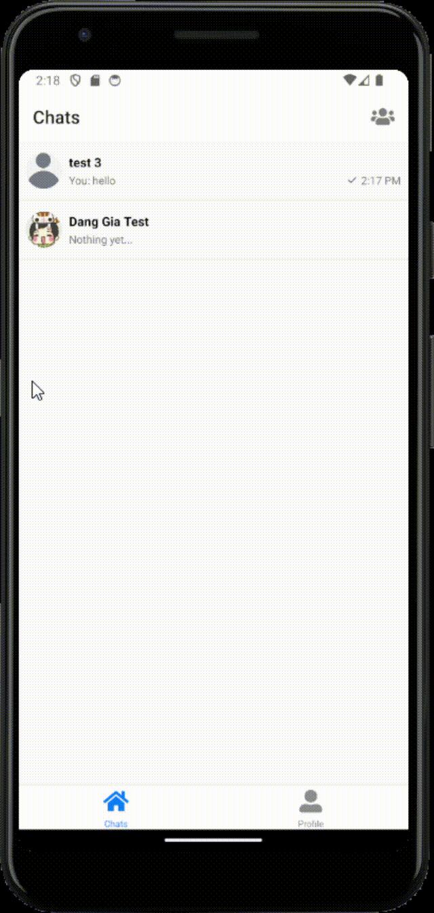

<h3 align="center">A Telegram Clone created using React Native, Stream Chat and Supabase</h3>

  
  <h4 align="center">Login Screen</h4>
  
A login and sign up screen that can use both email and username to login and use email to sign up. 
    The data will be push on the Supabase database and Stream Chat

  
  <h4 align="center">Chats Tab</h4>
  
After successfully sign in/ sign up, you will be navigate to the chats screen with your existing conversation

  
  <h4 align="center">Other Users Tab</h4>
  
After you press the little icon from the top right, you will be navigate to this screen with the other users to chat with

  
  <h4 align="center">Creating a new chatt</h4>
  
After you choose one user and chat with them, it will create a 1 to 1 channel between you and that user, after that the chat will show in the Chats Tab with your latest message

  
  <h4 align="center">Profile Tab Screen</h4>
  
A Profile screen that you can update your avatar, your username and your full name. 
   And you can log out from this Tab

  
  <h4 align="center">Updating Image and Name</h4>
  
After update your avatar, your username and your full name. 
    The data gonna be sent to the Supabase Database.

React Native documentaries: https://reactnative.dev/docs/getting-started
Stream Chat: https://getstream.io/
Supabase: https://supabase.com/
